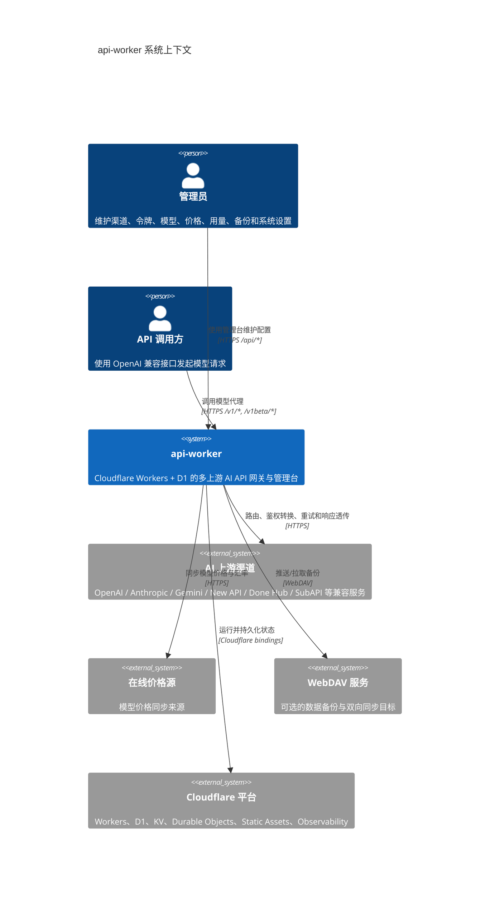
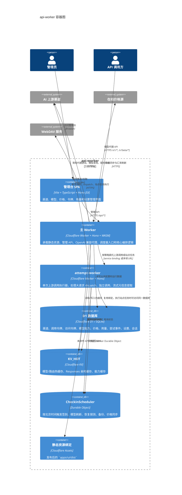
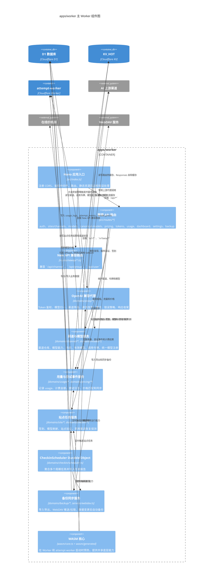
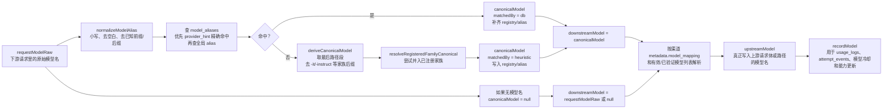
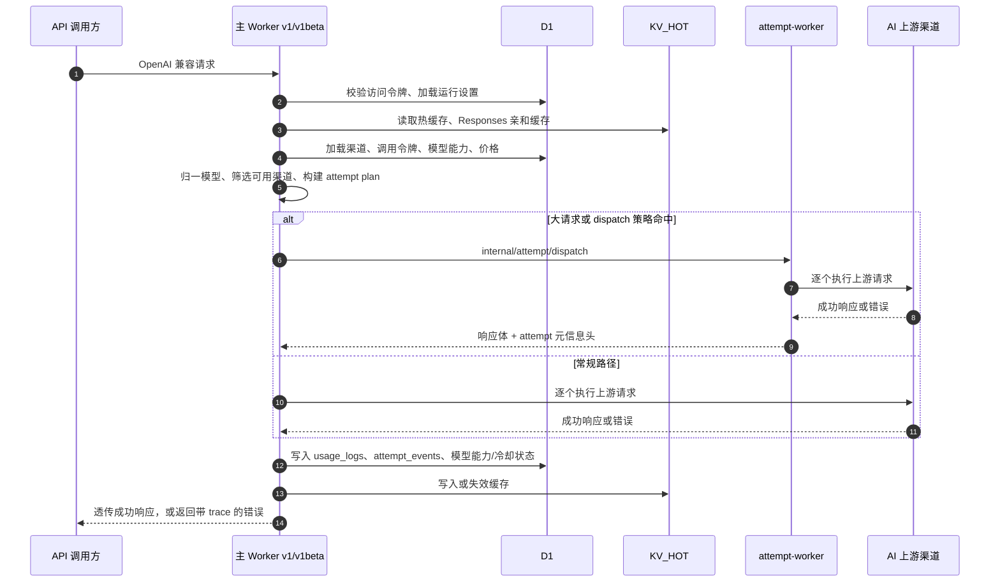

# C4 架构图

本文基于当前仓库代码和配置绘制，重点描述 `api-worker` 产品在运行时的系统边界、容器关系和主 Worker 内部组件。

## C1 系统上下文

## C2 容器图

## C3 主 Worker 组件图

## API 调用全流程

这张图聚焦 `ALL /v1/*` 与 `ALL /v1beta/*` 的代理主链路，包含模型归一、统一模型、渠道选择、attempt 执行和错误策略。

```mermaid
flowchart TD
	start["API 请求进入主 Worker<br/>/v1/* 或 /v1beta/*"] --> auth["tokenAuth<br/>读取 Bearer token，按 key_hash 查 D1"]
	auth --> authOk{"访问令牌可用？"}
	authOk -- 否 --> authErr["直接返回<br/>401 token_required/invalid_token<br/>402 quota_exceeded<br/>403 token_expired/token_disabled"]
	authOk -- 是 --> modelsReq{"是否 GET /v1/models？"}
	modelsReq -- 是 --> modelsList["读取 active 渠道<br/>按 token.allowed_channels 过滤<br/>返回本地聚合模型列表<br/>不请求上游"]
	modelsReq -- 否 --> settings["读取运行设置<br/>重试、超时、冷却、禁用、usage、offload、Responses 亲和"]

	settings --> detect["按路径识别 downstreamProvider 与 endpointType<br/>openai / anthropic / gemini<br/>chat / responses / embeddings / images / passthrough"]
	detect --> detectOk{"识别成功？"}
	detectOk -- 否 --> detectErr["502 provider_detect_failed<br/>写入早期 usage error"]
	detectOk -- 是 --> body["读取请求体<br/>判断大请求 offload<br/>OpenAI 请求会修复 tool_call 链与 responses 图片字段"]

	body --> modelRaw["提取 requestModelRaw<br/>来源：请求体 model 或 Gemini 路径模型"]
	modelRaw --> canonical["resolveCanonicalModel<br/>先查 model_aliases/model_registry<br/>未命中则启发式归一并写回 alias/registry"]
	canonical --> downstream["得到 downstreamModel<br/>canonicalModel 存在则使用统一模型<br/>否则使用 requestModelRaw"]
	downstream --> validate["校验工具 schema 与 OpenAI tool_call 链"]
	validate --> validateOk{"请求结构有效？"}
	validateOk -- 否 --> validateErr["400 request_validation<br/>或 409 tool_call_chain<br/>写入早期 usage error"]
	validateOk -- 是 --> loadChannels["读取 active channels 与 channel_call_tokens<br/>优先 KV_HOT，未命中查 D1 后回写短缓存"]

	loadChannels --> allowed["按访问令牌 allowed_channels 过滤渠道"]
	allowed --> compatible["selectCandidateChannels<br/>检查显式模型映射、已验证/有效模型、手工排除列表"]
	compatible --> attemptable["resolveAttemptableChannels<br/>检查 passthrough provider、上游模型、Gemini 模型要求、匹配调用令牌"]
	attemptable --> affinity["OpenAI Responses 亲和处理<br/>function_call_output 需要 previous_response_id<br/>命中 KV 亲和时优先固定到原渠道"]
	affinity --> affinityOk{"亲和要求满足？"}
	affinityOk -- 否 --> affinityErr["409 responses_previous_response_id_required<br/>或亲和相关错误<br/>写入早期 usage error"]
	affinityOk -- 是 --> cooldown["过滤处于模型冷却期的渠道"]
	cooldown --> candidatesOk{"还有候选渠道？"}
	candidatesOk -- 否 --> candidateErr["503 upstream_cooldown<br/>或 no_available_channels<br/>或 no_routable_channels<br/>写入早期 usage error"]
	candidatesOk -- 是 --> order["buildAttemptSequence<br/>按优先级、权重、最大重试数生成渠道顺序"]
	order --> orderOk{"排序成功？"}
	orderOk -- 否 --> orderErr["502 weighted_order_failed<br/>写入早期 usage error"]
	orderOk -- 是 --> plan["buildChannelAttemptPlan<br/>结合统一模型 alias、渠道原始模型、模型映射<br/>固定每次尝试的 upstreamModel"]

	plan --> dispatch{"大请求或 dispatch 策略命中？"}
	dispatch -- 是 --> attemptWorker["发送到 attempt-worker<br/>/internal/attempt/dispatch<br/>由执行器逐个请求上游并返回元信息头"]
	dispatch -- 否 --> localLoop["主 Worker 本地 attempt loop"]
	attemptWorker --> attemptResult["得到单次 attempt 响应"]
	localLoop --> prepare["prepareAttemptRequest<br/>解析 request_entry<br/>转换 provider 请求体<br/>注入上游鉴权头<br/>处理 stream_options 与 query/header overrides"]
	prepare --> fetchUpstream["请求 AI 上游渠道"]
	fetchUpstream --> attemptResult

	attemptResult --> upstreamOk{"上游响应可作为成功？"}
	upstreamOk -- 是 --> successCheck["检查 usage、流式元信息、异常成功响应、zero completion"]
	successCheck --> successOk{"通过成功判定？"}
	successOk -- 是 --> selected["选中 selectedResponse<br/>记录 attempt ok<br/>必要时更新模型能力"]
	successOk -- 否 --> successFailure["构造成功响应失败原因<br/>usage_missing / stream_meta / abnormal_success / usage_zero_completion_tokens"]
	upstreamOk -- 否 --> upstreamFailure["解析 HTTP/fetch 错误<br/>归一 error_code<br/>识别 responses_tool_call_chain_mismatch 与 stream_options_unsupported"]

	successFailure --> policy["resolveProxyErrorDecision<br/>按 return / sleep / disable / retry 策略处理"]
	upstreamFailure --> policy
	policy --> action{"策略动作"}
	action -- return --> directErr["立即返回上游/归一错误<br/>保留 trace 与 attempt 计数"]
	action -- disable --> disable["记录渠道错误命中<br/>达到阈值则临时/永久禁用渠道<br/>失效 KV_HOT 后尝试下一个"]
	action -- sleep --> sleep["等待 retry_sleep_ms 后尝试下一个"]
	action -- retry --> retry["必要时记录模型冷却<br/>尝试下一个"]
	disable --> moreAttempts{"还有 attempt？"}
	sleep --> moreAttempts
	retry --> moreAttempts
	moreAttempts -- 是 --> localLoop
	moreAttempts -- 否 --> allFailed["无成功响应<br/>返回 503 proxy_all_attempts_failed<br/>附 trace_id、失败次数、top_reason、failures"]

	selected --> finalize["finalizeSelectedResponse<br/>适配上下游响应格式<br/>写 usage_logs 与 attempt_events<br/>Responses 成功时写 response_id 亲和缓存"]
	finalize --> stream{"是否流式响应？"}
	stream -- 是 --> streamWrap["包装响应流<br/>结束/断开/失败时补记 usage 或 downstream_stream_failed"]
	stream -- 否 --> nonStream["非流式必须有 usage<br/>缺失则转 usage_missing error"]
	streamWrap --> returnOk["返回客户端<br/>附 x-ha-trace-id、attempt/candidate 计数、质量头"]
	nonStream --> returnOk
```

## 模型名称转换链路

### 关键字段

| 字段 | 含义 | 主要用途 |
| --- | --- | --- |
| `requestModelRaw` | 客户端请求里的原始模型名 | 审计、alias 学习、失败排查 |
| `canonicalModel` | 统一模型名，来自 DB alias 或启发式归一 | 跨渠道匹配、价格、统计、冷却 |
| `downstreamModel` | 本次代理内部使用的目标模型，优先等于 `canonicalModel` | 渠道筛选、attempt plan |
| `upstreamModel` | 单个渠道最终请求上游时使用的模型名 | 写入上游请求体或路径 |
| `recordModel` | 本次 attempt 记录与冷却使用的模型名 | `usage_logs`、`attempt_events`、模型能力 |

统一模型解析本身不会因为 DB alias 写入失败而中断请求；代码会退回启发式结果继续路由。真正会提前失败的通常是鉴权、路径 provider 识别、请求结构校验、渠道不可路由、亲和链缺失或全部上游尝试失败。

## 代理请求时序

## 代码依据

- 入口与路由：`apps/worker/src/index.ts`、`apps/attempt-worker/src/index.ts`
- Cloudflare 绑定：`apps/worker/wrangler.toml`、`apps/attempt-worker/wrangler.toml`
- 数据结构：`apps/worker/src/db/schema.sql`、`apps/worker/migrations/*`
- 代理编排：`apps/worker/src/domains/proxy/route.ts`、`apps/worker/src/domains/proxy/*`
- 调用执行器：`apps/attempt-worker/src/routes/attempt.ts`
- 站点任务与定时调度：`apps/worker/src/domains/site/task-dispatcher.ts`、`apps/worker/src/domains/checkin/scheduler.ts`
- 管理台：`apps/ui/src/app/App.tsx`、`apps/ui/src/App.tsx`（Vite 兼容入口）、`apps/ui/src/core/api.ts`
